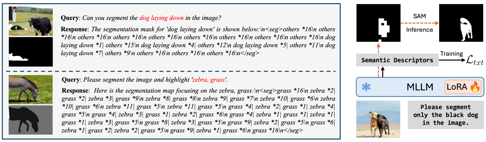
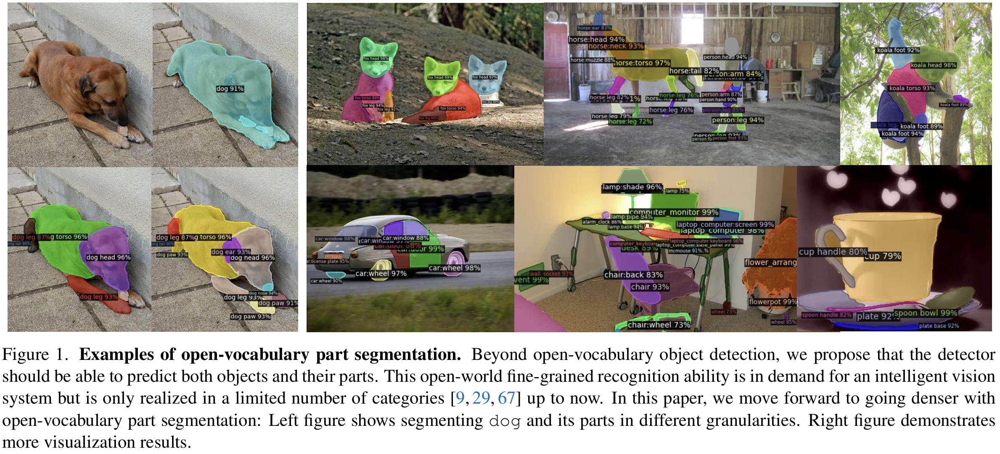
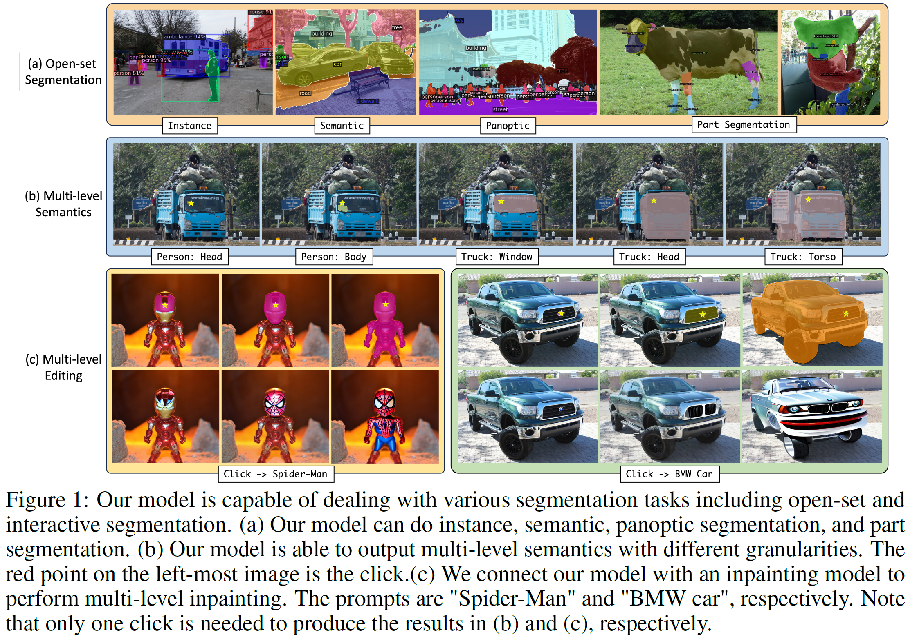
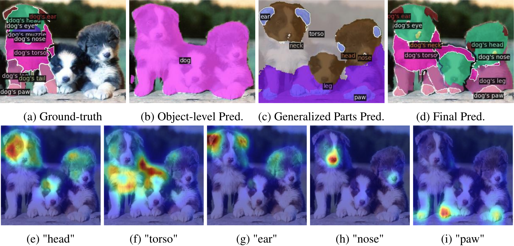
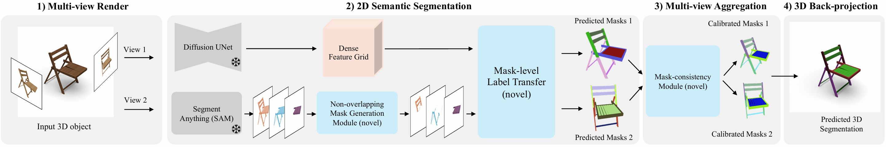
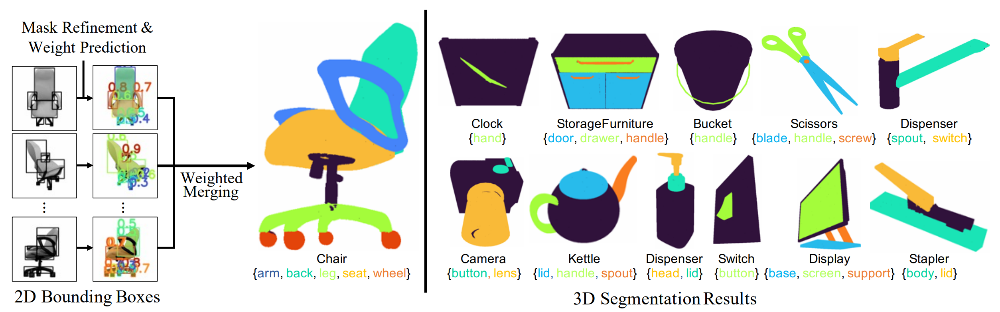
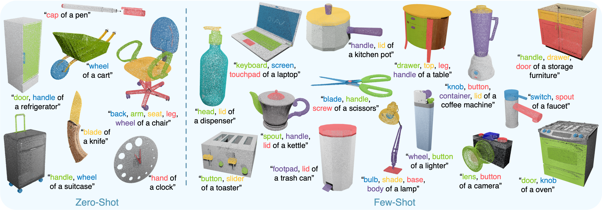
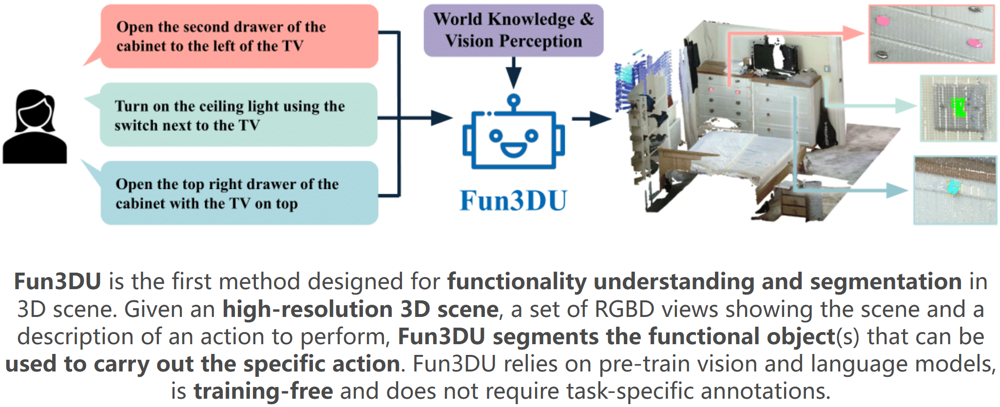
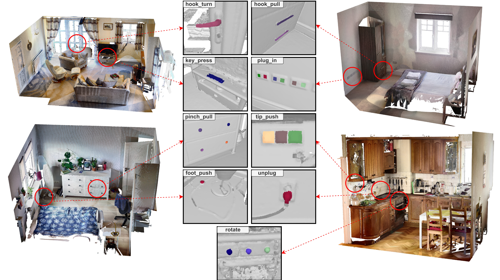
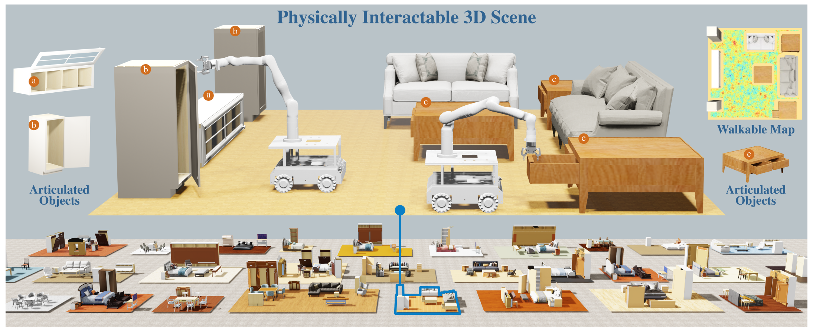

### 2D semantic segmentation

1. [Text4Seg: Reimagining Image Segmentation as Text Generation](https://mc-lan.github.io/Text4Seg/)
   

### 3D semantic segmentation

1. SegmentAnything3D
   - [Pointcept/SegmentAnything3D: [ICCV'23 Workshop\] SAM3D: Segment Anything in 3D Scenes](https://github.com/Pointcept/SegmentAnything3D)
2. PvT
   - [Pointcept/Pointcept: Pointcept: a codebase for point cloud perception research. Latest works: PTv3 (CVPR'24 Oral), PPT (CVPR'24), OA-CNNs (CVPR'24), MSC (CVPR'23)](https://github.com/Pointcept/Pointcept)
3. ODIN
   - [ayushjain1144/odin: Code for the paper: "ODIN: A Single Model for 2D and 3D Segmentation" (CVPR 2024)](https://github.com/ayushjain1144/odin)
4. [Segment3D: Learning Fine-Grained Class-Agnostic 3D Segmentation without Manual Labels](https://segment3d.github.io/)
5. [Prompt Depth Anything](https://promptda.github.io/)
   - [DepthAnything/PromptDA: Prompt Depth Anything](https://github.com/DepthAnything/PromptDA)
   - [rerun-io/prompt-da: PromptDepthAnything example](https://github.com/rerun-io/prompt-da)
     

### 2D part segmentation

1. VLPart: [ICCV2023\] VLPart: Going Denser with Open-Vocabulary Part Segmentation](https://github.com/facebookresearch/VLPart)
   

2. Semantic-SAM: [Official implementation of the paper "Semantic-SAM: Segment and Recognize Anything at Any Granularity"](https://github.com/UX-Decoder/Semantic-SAM) [ECCV 2024\] 

   

3. Part-CLIPseg: [Official PyTorch Implementation of PartCLIPSeg](https://github.com/kaist-cvml/part-clipseg) [NIPS 2024]
   

### 3D part segmentation

1. [3x2: 3D Object Part Segmentation by 2D Semantic Correspondences](https://rehg.org/publication/pub40/) [ECCV 2024]
   
2. [PartSTAD: 2D-to-3D Part Segmentation Task Adaptation](https://partstad.github.io/) [ECCV 2024]
   
3. [PartSLIP](https://colin97.github.io/PartSLIP_page/) [ECCV 2023]
   

### Embodied interactive/interactable segmentation

1. [FANG-Xiaolin/uncos](https://github.com/FANG-Xiaolin/uncos)
   
2. [Functionality understanding and segmentation in 3D scenes](https://jcorsetti.github.io/fun3du/)
   
3. [SceneFun3D](https://scenefun3d.github.io/) [CVPR 2024 Oral]
   

### Embodied Interactable 3D Generation

1. [PhyScene: Physically Interactable 3D Scene Synthesis for Embodied AI](https://physcene.github.io/)
   

### Others

#### Navigation

1. [Hierarchical Open-Vocabulary 3D Scene Graphs for Language-Grounded Robot Navigation](https://hovsg.github.io/)
   