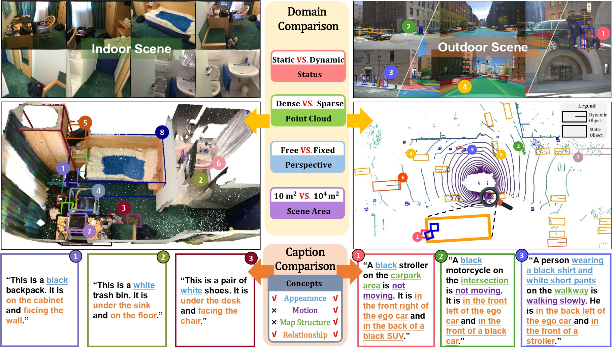
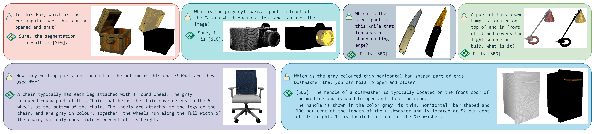
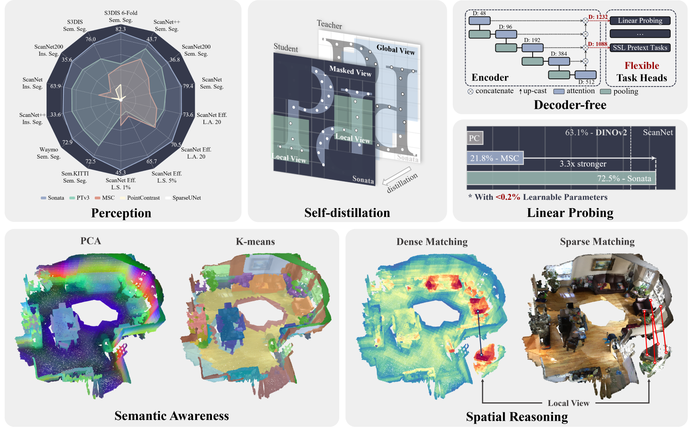

### 2D semantic segmentation

1. [Text4Seg: Reimagining Image Segmentation as Text Generation](https://mc-lan.github.io/Text4Seg/)
   

### 3D semantic segmentation

1. SegmentAnything3D
   - [Pointcept/SegmentAnything3D: [ICCV'23 Workshop\] SAM3D: Segment Anything in 3D Scenes](https://github.com/Pointcept/SegmentAnything3D)
   
2. PvT
   - [Pointcept/Pointcept: Pointcept: a codebase for point cloud perception research. Latest works: PTv3 (CVPR'24 Oral), PPT (CVPR'24), OA-CNNs (CVPR'24), MSC (CVPR'23)](https://github.com/Pointcept/Pointcept)
   
3. ODIN
   - [ayushjain1144/odin: Code for the paper: "ODIN: A Single Model for 2D and 3D Segmentation" (CVPR 2024)](https://github.com/ayushjain1144/odin)
   
4. [Segment3D: Learning Fine-Grained Class-Agnostic 3D Segmentation without Manual Labels](https://segment3d.github.io/)

6. [Scalable 3D Panoptic Segmentation As Superpoint Graph Clustering](https://drprojects.github.io/supercluster)

   - https://github.com/drprojects/superpoint_transformer

     
   
6. [Open-YOLO 3D: Towards Fast and Accurate Open-Vocabulary 3D Instance Segmentation](https://arxiv.org/abs/2406.02548) [ICLR 2025 Oral]

   - [ICLR 2025 (Oral 📢) \] Our OpenYOLO3D model achieves state-of-the-art performance in Open Vocabulary 3D Instance Segmentation on ScanNet200 and Replica datasets with up ∼16x speedup compared to the best existing method in literature.](https://github.com/aminebdj/OpenYOLO3D?tab=readme-ov-file)
     

7. [EmbodiedSAM: Online Segment Any 3D Thing in Real Time](https://xuxw98.github.io/ESAM/) [ICLR 2025 Oral]

   - [ICLR 2025, Oral\] EmbodiedSAM: Online Segment Any 3D Thing in Real Time](https://github.com/xuxw98/ESAM)

     

8. [Search3D: Hierarchical Open-Vocabulary 3D Segmentation](https://arxiv.org/pdf/2409.18431) [Arxiv 2025.1]

   

9. [OpenNeRF Open Set 3D Neural Scene Segmentation with Pixel-Wise Features and Rendered Novel Views](https://arxiv.org/pdf/2404.03650) [ICLR 2024]

   -  [ICLR 2024\] OpenSet 3D Neural Scene Segmentation with Pixel-wise Features and Rendered Novel Views](https://github.com/opennerf/opennerf)

10. [Vocabulary-Free 3D Instance Segmentation with Vision and Language Assistant](https://arxiv.org/pdf/2408.10652) [Arxiv 2024.8]

   

11. [SAMPro3D: Locating SAM Prompts in 3D for Zero-Shot Instance Segmentation](https://github.com/GAP-LAB-CUHK-SZ/SAMPro3D) [3DV 2025]
    
12. [PLA: Language-Driven Open-Vocabulary 3D Scene Understanding](https://dingry.github.io/projects/PLA) [CVPR 2023]
    
13. [RegionPLC: Regional Point-Language Contrastive Learning for Open-World 3D Scene Understanding](https://jihanyang.github.io/projects/RegionPLC) [CVPR 2024]
    
14. [AGILE3D: Attention Guided Interactive Multi-object 3D Segmentation](https://ywyue.github.io/AGILE3D/) [ICLR 2024]
    
15. [Scale Disparity of Instances in Interactive Point Cloud Segmentation](https://arxiv.org/pdf/2407.14009) [IROS 2024]
16. [iSeg: Interactive 3D Segmentation via Interactive Attention](https://threedle.github.io/iSeg/) [SIGGRAPH Asia 2024]
    

### Multi-granularity segmentation
1. [GARField:Group Anything with Radiance Fields](https://www.garfield.studio/) [CVPR2024]
    

2. [3D Segmentation of Humans in Point Clouds with Synthetic Data](https://human-3d.github.io/)[CVPR2023]

### 3D Synthetic Data
1. [Pre-training with 3D Synthetic Data](https://arxiv.org/pdf/2503.24229)

### 3D caption

1. [TOD3Cap: Towards 3D Dense Captioning in Outdoor Scenes](https://arxiv.org/pdf/2403.19589) [ECCV 2024]
   - [ECCV 2024\] TOD3Cap: Towards 3D Dense Captioning in Outdoor Scenes](https://github.com/jxbbb/TOD3Cap)
     

### 2D part segmentation

1. VLPart: [ICCV2023\] VLPart: Going Denser with Open-Vocabulary Part Segmentation](https://github.com/facebookresearch/VLPart)
   

2. Semantic-SAM: [Official implementation of the paper "Semantic-SAM: Segment and Recognize Anything at Any Granularity"](https://github.com/UX-Decoder/Semantic-SAM) [ECCV 2024\] 

   

3. Part-CLIPseg: [Official PyTorch Implementation of PartCLIPSeg](https://github.com/kaist-cvml/part-clipseg) [NIPS 2024]
   

### 3D part segmentation

1. [3x2: 3D Object Part Segmentation by 2D Semantic Correspondences](https://rehg.org/publication/pub40/) [ECCV 2024]
   
2. [PartSTAD: 2D-to-3D Part Segmentation Task Adaptation](https://partstad.github.io/) [ECCV 2024]
   
3. [PartSLIP](https://colin97.github.io/PartSLIP_page/) [ECCV 2023]
   
4. [SAMPart3D](https://yhyang-myron.github.io/SAMPart3D-website/) [Arxiv 2024.10]
   
5. [PARIS3D: Reasoning-based 3D Part Segmentation Using Large Multimodal Model](https://arxiv.org/pdf/2404.03836) [ECCV 2024]
   

### 3D Physical Attributes Annotation

1. [NeRF2Physics: Physical Property Understanding from Language-Embedded Feature Fields](https://ajzhai.github.io/NeRF2Physics/) [CVPR 2024]

   

2. [PUGS: Zero-shot Physical Understanding with Gaussian Splatting](https://evernorif.github.io/PUGS/) [ICRA 2025]
   

### Embodied interactive/interactable segmentation

1. [FANG-Xiaolin/uncos](https://github.com/FANG-Xiaolin/uncos)
   
2. [Functionality understanding and segmentation in 3D scenes](https://jcorsetti.github.io/fun3du/)
   
3. [SceneFun3D](https://scenefun3d.github.io/) [CVPR 2024 Oral]
   

### 3D Affordance Detection

1. [3D-AffordanceLLM: Harnessing Large Language Models for Open-Vocabulary Affordance Detection in 3D Worlds](https://arxiv.org/pdf/2502.20041) [ICLR 2025]
   

### 3D Grounding (Detection/Intention)

1. [Intent3D: 3D Object Detection in RGB-D Scans Based on Human Intention](https://github.com/WeitaiKang/Intent3D) [ICLR 2025]
1. [SeeGround: See and Ground for Zero-Shot Open-Vocabulary 3D Visual Grounding](https://seeground.github.io/) [CVPR 2025]
   

### Embodied Interactable 3D Generation

1. [PhyScene: Physically Interactable 3D Scene Synthesis for Embodied AI](https://physcene.github.io/)
   

### 3D Visual Understanding

1. [Sonata: Self-Supervised Learning of Reliable Point Representations](https://xywu.me/sonata/) [CVPR 2025]
   
2. [SpatialLM: Large Language Model for Spatial Understanding](https://manycore-research.github.io/SpatialLM/)
   

### Others

### Survey

1. [When LLMs step into the 3D World A Survey and Meta-Analysis of 3D Tasks via Multi-modal Large Language Models](https://arxiv.org/pdf/2405.10255) [2024.5]

### 3D Feature Extraction

1. [Duoduo CLIP: Efficient 3D Understanding with Multi-View Images](https://github.com/3dlg-hcvc/DuoduoCLIP) [ICLR 2025]

#### Navigation

1. [Hierarchical Open-Vocabulary 3D Scene Graphs for Language-Grounded Robot Navigation](https://hovsg.github.io/)
   

### Room Segmentation

1. [Semantic Layering in Room Segmentation via LLMs]([SeLRos](https://sites.google.com/view/selros)) [IROS 2024]
   

### 3D Scene Graph

1. [ConceptGraphs: Open-Vocabulary 3D Scene Graphs for Perception and Planning](https://concept-graphs.github.io/))
   

### Depth Estimation

1. [Depth Anything V2](https://depth-anything-v2.github.io/) [NIPS 2024]
   - [DepthAnything/Depth-Anything-V2: [NeurIPS 2024\] Depth Anything V2. A More Capable Foundation Model for Monocular Depth Estimation](https://github.com/DepthAnything/Depth-Anything-V2)
2. [Video Depth Anything](https://videodepthanything.github.io/) [Arxiv 2025.1]
   - [DepthAnything/Video-Depth-Anything: Video Depth Anything: Consistent Depth Estimation for Super-Long Videos](https://github.com/DepthAnything/Video-Depth-Anything)
3. [Prompt Depth Anything](https://promptda.github.io/) [Arxiv 2024.12]
   - [DepthAnything/PromptDA: Prompt Depth Anything](https://github.com/DepthAnything/PromptDA)
   - [rerun-io/prompt-da: PromptDepthAnything example](https://github.com/rerun-io/prompt-da)
     
